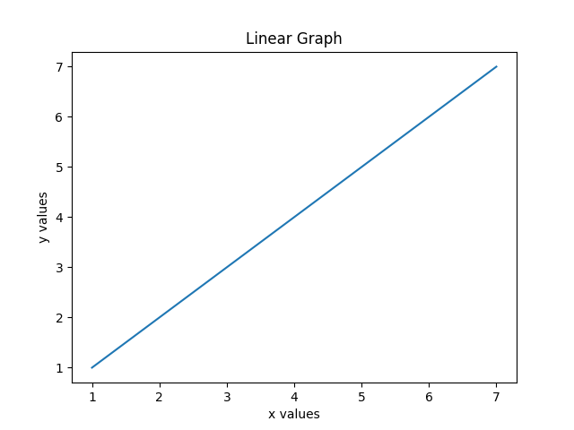

# Matplotlib Flask API

Make a post request to the API and get back a png of the graph. Currently only line graphs are supported. Make sure to include x_values and y_values in your post request. The rest of the params (which are optional) can include any of the kwargs found [here](https://matplotlib.org/3.2.1/api/_as_gen/matplotlib.figure.Figure.html#matplotlib.figure.Figure.add_subplot).

### Example:

#####Request Body (JSON):
```json
{
    "title": "Linear Graph",
    "x_values": [1, 2, 3, 4, 5, 6, 7],
    "y_values": [1, 2, 3, 4, 5, 6, 7],
    "xlabel": "x values",
    "ylabel": "y values"
}
```
#####API Response:
